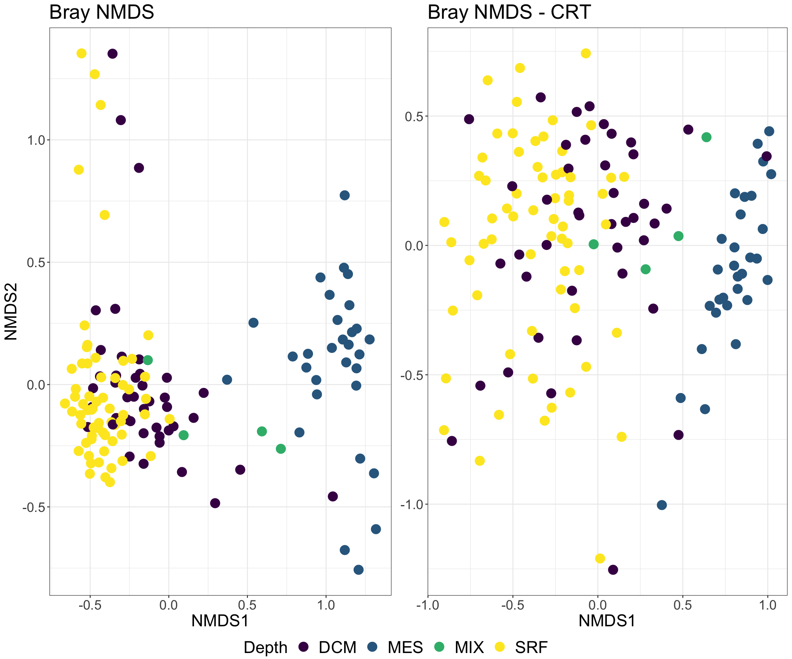

Relative Abundance and Community Similiarity of Conditionally Rare Taxa
====

## Quick Start
- Open crt_taraoceans.Rmd
- Click "knit"
- crt.Rds contains the output from the CRT function and can be loaded in case of time or memory constraints.

## Example Output

## Summary
### What is the visualization?
- WThis is an non-metric multidimensional scaling (NMDS) plot used to visualize the relationship between communities based on a chosen distance metric (i.e., Bray-Curtis, Unifrac, etc.).
- DCM = Deep Chlorophyll Maximum Layer; MES = Mesopelagic Zone; MIX = Marine Epipelagic Mixed Layer; SRF = Surface Water Layer

### What data goes in (and what preprocessing is necessary)?
- Visualization requires otu table, taxonomy table, and metadata for creating a phyloseq object.
Output "OTUdf_cr_excel.txt" requires user to open file in excel to delete first row, first column, then the contents of the first cell. The amended file is saved as "OTUdf_cr_input.txt" and used for the CRT function.

### How should we use/interpret this visualization?
- Visualization can be used to compare the similarity of communities that include all taxa and conditionally rare taxa.
- Depth is responsible for 35% and 19% of the variance observed in community composition of all taxa and conditionally rare taxa, respectively
- Province is responsible for 13% and 15% of the variance observed in community composition of all taxa and conditionally rare taxa, respectively.
- Depth may not be as important as other factors in structuring the microbial communities of conditionally rare taxa.
 
## Authors
- Alexandria Igwe
- github id: anigwe
- ORCID:0000-0001-5993-1203

## Links

Zenodo Binder, doi: LINK_TO_BINDER

Github Binder: 

Github Repository: https://github.com/speeding-up-science-workshops/ord_abund_raretaxa

